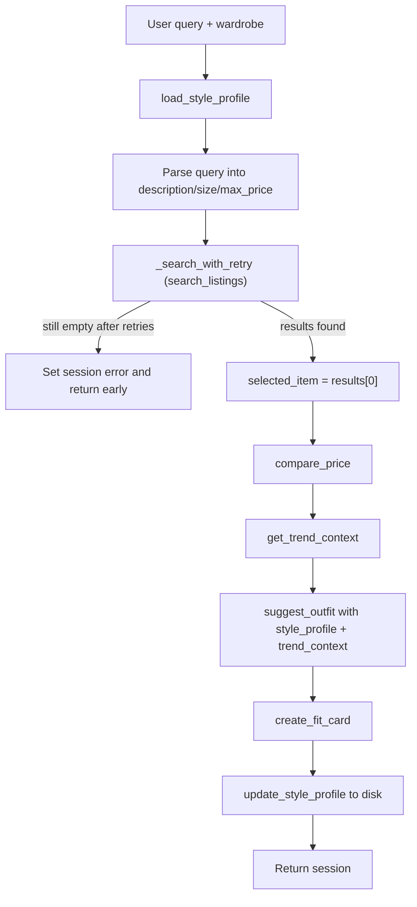

# FitFindr

FitFindr is a multi-tool AI agent that helps users find secondhand clothing and figure out how to wear it. A natural-language query flows through a planning loop that searches mock listings, suggests an outfit against the user's wardrobe, and writes a shareable fit card, with a different path when search returns nothing.

```bash
python app.py          # Gradio UI
python agent.py        # CLI happy path + no-results test
pytest tests/          # tool tests (LLM tests skip without GROQ_API_KEY)
```

## Setup

```bash
python -m venv .venv
source .venv/bin/activate          # Mac/Linux
pip install -r requirements.txt
```

Create a `.env` file in the repo root (gitignored; never commit it):

```
GROQ_API_KEY=your_key_here
```

Get a free key at [console.groq.com](https://console.groq.com). Sanity-check the data layer:

```bash
python utils/data_loader.py
```

## Data

`data/listings.json` holds 40 mock secondhand listings. Each listing dict has: `id`, `title`, `description`, `category`, `style_tags`, `size`, `condition`, `price`, `colors`, `brand`, and `platform`.

```python
from utils.data_loader import load_listings, get_example_wardrobe, get_empty_wardrobe
```

`get_example_wardrobe()` returns a closet with 10 items for testing. `get_empty_wardrobe()` is the new-user path for the empty-wardrobe branch.

---

## Tool Inventory

All three tools live in `tools.py`. Signatures match the implementation exactly.

### `search_listings(description, size, max_price)`

| | |
|---|---|
| **Inputs** | `description` (`str`): keywords for what the user wants (e.g. `"vintage graphic tee"`). `size` (`str` \| `None`): size filter; matched loosely (case-insensitive substring, so `"M"` hits `"S/M"`). `None` skips the filter. `max_price` (`float` \| `None`): inclusive price ceiling. `None` skips the filter. |
| **Returns** | `list[dict]`: full listing dicts sorted by keyword relevance (highest first). Score = count of description keywords found in title + description + `style_tags`. Listings that pass filters but score 0 are dropped. Returns `[]` on no match; never raises. |
| **Purpose** | Pure-Python search over `load_listings()`; no LLM. |

Test in isolation:

```bash
python -c "from tools import search_listings; print(search_listings('vintage graphic tee', size=None, max_price=50))"
```

### `suggest_outfit(new_item, wardrobe, style_profile=None, trend_context=None)`

| | |
|---|---|
| **Inputs** | `new_item` (`dict`): a listing dict, usually `search_results[0]`. `wardrobe` (`dict`): shaped `{"items": [...]}`; each item has `name`, `category`, `colors`, `style_tags`, and optional `notes`. `style_profile` (`dict` \| `None`, optional): saved preferences from prior sessions; used when the wardrobe is empty. `trend_context` (`str` \| `None`, optional): trend summary from `get_trend_context()`; woven into the LLM prompt when present. |
| **Returns** | `str`: non-empty outfit suggestion naming specific wardrobe pieces, remembered preferences (empty wardrobe + profile), or general styling advice (empty wardrobe, no profile). LLM errors return a plain fallback string; never `""`, never raises. |
| **Purpose** | Calls Groq `llama-3.3-70b-versatile` to style the thrifted find against what the user already owns. |

Test in isolation:

```bash
python -c "
from tools import search_listings, suggest_outfit
from utils.data_loader import get_empty_wardrobe
r = search_listings('vintage graphic tee', size=None, max_price=50)
print(suggest_outfit(r[0], get_empty_wardrobe()))
"
```

### `create_fit_card(outfit, new_item)`

| | |
|---|---|
| **Inputs** | `outfit` (`str`): the suggestion string from `suggest_outfit`. `new_item` (`dict`): the listing dict (item name, price, platform). |
| **Returns** | `str`: 2-4 sentence casual caption for an OOTD post. Empty/whitespace `outfit` returns a descriptive error string (no exception). Uses temperature 1.0 so output varies across inputs. |
| **Purpose** | Calls Groq `llama-3.3-70b-versatile` to turn the outfit into something shareable. |

Test in isolation:

```bash
python -c "from tools import create_fit_card; print(create_fit_card('', {'title': 'Faded Band Tee', 'price': 22, 'platform': 'Depop'}))"
```

### `compare_price(item)` *(stretch)*

| | |
|---|---|
| **Inputs** | `item` (`dict`): a listing dict, usually the top search result. |
| **Returns** | `str`: a price verdict (`Good deal`, `Fair price`, or `Above typical`) with reasoning — median of comparable listings, price range, and 2–3 named comps with their prices. Never raises. |
| **Purpose** | Pure-Python comparison against similar items in `load_listings()`. Runs on the happy path after a listing is selected; informational only (does not block styling). |

**How comparisons are made:**

1. Exclude the target listing by `id`.
2. Score every other listing: same `category` required; +2 per shared `style_tag`, +2 for matching `brand`, +1 per shared title keyword (same stopword filter as search).
3. Take the top 8 scored listings; need at least 2 for a median.
4. Compare the item's price to the median: ≤85% → Good deal; ≤115% → Fair price; else Above typical.
5. Return a sentence naming the verdict, median, range, and up to three comparable titles.

Test in isolation:

```bash
python -c "
from tools import search_listings, compare_price
item = search_listings('vintage graphic tee', size=None, max_price=50)[0]
print(compare_price(item))
"
```

### `update_style_profile(query, selected_item)` *(stretch)*

| | |
|---|---|
| **Inputs** | `query` (`str`): the original user query; regex extracts style cues (`I mostly wear …`, `my style is …`, etc.). `selected_item` (`dict` \| `None`): top search result; `style_tags` and `colors` are merged into the profile. |
| **Returns** | `str`: non-empty summary of what was remembered (e.g. *"Remembered — phrases: baggy jeans, chunky sneakers; tags: streetwear, y2k"*). Never raises. |
| **Purpose** | Hybrid preference learning (query regex + listing tags) persisted to disk so future sessions can style against remembered preferences even when the wardrobe is empty. |

**Storage:** preferences are saved to `data/style_profile.json` (gitignored). A committed template lives at `data/style_profile.default.json`. Override the path in tests with `FITFINDR_PROFILE_PATH`.

**Profile schema:**

```json
{
  "preference_phrases": ["baggy jeans", "chunky sneakers"],
  "style_tags": ["streetwear", "baggy"],
  "colors": [],
  "typical_size": null,
  "interaction_count": 0
}
```

Test in isolation:

```bash
python -c "
from tools import search_listings, update_style_profile
item = search_listings('vintage graphic tee', size=None, max_price=50)[0]
print(update_style_profile('I mostly wear baggy jeans and chunky sneakers.', item))
"
```

### `get_trend_context(size)` *(stretch)*

| | |
|---|---|
| **Inputs** | `size` (`str` \| `None`): optional size filter (loose substring match, same as search — `"M"` hits `"S/M"`). `None` aggregates trends across all listings. |
| **Returns** | `str`: non-empty summary naming 3–5 trending `style_tags` plus a brief note about hot categories/platforms (e.g. *"Trending in size M right now: Y2K, streetwear, vintage — lots of graphic tees and tops on depop."*). Never raises. |
| **Purpose** | Pure-Python trend signal from the mock marketplace dataset. Runs on the happy path after search succeeds; passed into `suggest_outfit` so outfit ideas reflect what's trending. |

**Data source:** `data/listings.json` via `load_listings()`. The tool counts `style_tags` across listings (optionally filtered by size), ranks tags by frequency, and picks the top 3–5. Category and platform counts add a short "what's hot" note. No live Depop/Poshmark API — the committed mock dataset simulates platform tag data.

Test in isolation:

```bash
python -c "from tools import get_trend_context; print(get_trend_context('M'))"
```

---

## Planning Loop

`run_agent()` in `agent.py` walks a fixed tool order but **branches on results**; it does not call all three tools unconditionally.



**Step-by-step conditional logic:**

0. **Load profile:** `load_style_profile()` → `session["style_profile"]` from `data/style_profile.json`.
1. **Parse:** `_parse_query()` uses regex to pull `max_price` (`under $30`, `below 40`, bare `$25`) and `size` (`size M`, standalone `XXS`/`XS`/`XL`/`XXL`). Leftover text becomes `description`. Stored in `session["parsed"]`.
2. **Search:** `_search_with_retry(parsed)` wraps `search_listings` with automatic loosening → `session["search_results"]` and optionally `session["search_retry"]`.
3. **Branch (the decision that matters):**
   - **If** `search_results` is still empty after all retries → build a criteria-specific `session["error"]` (names description, price, size, and which loosening steps were tried) and **return early**. `selected_item`, `outfit_suggestion`, and `fit_card` stay `None`. `suggest_outfit` is **not** called. Profile is **not** updated.
   - **Else** → `session["selected_item"] = search_results[0]`. If a retry succeeded, `session["search_retry"]` holds a note shown in the listing panel.
4. **Price check:** `compare_price(selected_item)` → `session["price_assessment"]`. Informational only — the loop continues even if comparables are thin.
5. **Trend context:** `get_trend_context(parsed["size"])` → `session["trend_context"]`. Aggregates top `style_tags` from `data/listings.json` (optionally size-filtered). Informational only — the loop continues.
6. **Suggest:** `suggest_outfit(selected_item, wardrobe, style_profile=..., trend_context=...)` → `session["outfit_suggestion"]`. Trend context is woven into the LLM prompt when present. When the wardrobe is empty but the profile has saved prefs, uses the remembered-style prompt branch.
7. **Fit card:** `create_fit_card(outfit_suggestion, selected_item)` → `session["fit_card"]`.
8. **Remember:** `update_style_profile(query, selected_item)` → `session["style_profile_update"]` and persist to disk.
9. **Return** the session.

The loop is done when it either hits the early return (error) or fills `fit_card`.

---

## State Management

Everything for one interaction lives in a single `session` dict from `_new_session()`. Each tool writes its output into the session; the next tool reads from it, so the user never re-enters data between steps.

| Key | When set | Used by |
|-----|----------|---------|
| `query` | Session start | Reference only |
| `parsed` | After `_parse_query()` | Arguments to `search_listings` |
| `search_results` | After search / retry | Branch check; source for `selected_item` |
| `search_retry` | After successful retry | Listing panel (stretch) |
| `selected_item` | Top result on happy path | `compare_price`, `suggest_outfit`, `create_fit_card` |
| `wardrobe` | Session start | `suggest_outfit` |
| `style_profile` | Run start (`load_style_profile`) | `suggest_outfit` |
| `style_profile_update` | After `update_style_profile` | Outfit panel (stretch) |
| `price_assessment` | After compare_price | Listing panel (stretch) |
| `trend_context` | After get_trend_context | Outfit panel + suggest_outfit prompt (stretch) |
| `outfit_suggestion` | After suggest | `create_fit_card` |
| `fit_card` | After fit card | UI panel 3 |
| `error` | No-results early return (after retries) | UI panel 1 only |

**State passing example:** `search_results[0]` is stored as `selected_item` and passed into `compare_price`, `suggest_outfit`, and `create_fit_card`. `outfit_suggestion` flows directly into `create_fit_card` without the user typing it again.

`handle_query()` in `app.py` calls `run_agent()`, then maps the session to three Gradio panels: listing details (including the price assessment), outfit idea, fit card. On error, only the first panel shows the message.

---

## Stretch Features

### Price Comparison Tool

After a listing is selected, `compare_price()` scores other items in `data/listings.json` by category overlap, shared `style_tags`, brand match, and title keywords. It compares the asking price to the median of the top matches and returns a verdict with named comps — e.g. *"Good deal — Y2K Baby Tee at $18 is below the typical $23 median… Comps: Graphic Tee — 2003 Tour ($24); Vintage Band Tee ($19)."* The assessment appears at the bottom of the listing panel in the Gradio UI and in the CLI happy-path output from `python agent.py`.

### Style Profile Memory

FitFindr remembers style preferences across sessions in `data/style_profile.json` so users with an empty wardrobe do not have to re-describe what they wear every visit.

**How preferences are learned (hybrid):**

1. **Query regex** — phrases after cues like `I mostly wear`, `my style is`, `I prefer`, `I love wearing` (price/size tokens stripped first so search terms do not pollute the profile).
2. **Listing tags** — after a successful search, `style_tags` and `colors` from `selected_item` are merged into the saved profile.

**How preferences are used:** at the start of each run, `load_style_profile()` fills `session["style_profile"]`. When `suggest_outfit` runs with an empty wardrobe but a non-empty profile, it uses a remembered-style LLM prompt that names saved phrases and tags. The outfit panel shows *"Using remembered style: …"* when prefs exist, plus a *"📝 Remembered — …"* line after each successful update.

**Two-session demo** (Gradio: choose *Empty wardrobe* both times, or run `python agent.py` for the terminal block at the bottom):

| Session | Query | What happens |
|---------|-------|--------------|
| 1 | `vintage graphic tee under $30. I mostly wear baggy jeans and chunky sneakers.` | Saves phrases + tee tags to disk |
| 2 | `90s track jacket under $50` | Outfit references baggy jeans / chunky sneakers without re-entry |

```bash
python agent.py   # includes a two-session style-memory demo at the end
```

### Trend Awareness Tool

After search succeeds, `get_trend_context()` aggregates the most frequent `style_tags` from `data/listings.json` (optionally scoped to the parsed size). It returns a short summary like *"Trending in size M right now: Y2K, streetwear, vintage — lots of graphic tees and tops on depop."*

**Data source:** the committed mock listings dataset (`load_listings()`). Tag frequency across listings simulates what a live platform might surface as trending tags — no external API.

**How trends influence styling:** `session["trend_context"]` is passed into `suggest_outfit()`, which adds a *"Current thrift trends…"* block to the LLM prompt and asks the model to weave at least one trend into the outfit idea. The Gradio outfit panel shows the trend line at the top (`📈 …`) so users see what drove the suggestion.

**Demo:**

```bash
python -c "from tools import get_trend_context; print(get_trend_context('M'))"
python agent.py   # happy path prints Trends: … and a trend-awareness demo block at the end
```

In the Gradio UI, try `vintage graphic tee under $30, size M` — the outfit panel shows the trend summary above the styling suggestion.

### Retry Logic with Fallback

When the initial search returns no results, `_search_with_retry()` in `agent.py` automatically retries with progressively looser constraints before giving up:

1. **Drop size filter** (keep description + max_price) — if the query had a size.
2. **Raise price ceiling by 50%** (rounded up) — if the query had a max price and step 1 still found nothing.
3. **Drop both size and price** — description-only search as a last resort.

On retry success, `session["search_retry"]` explains what was adjusted (e.g. *"No exact matches — retried with dropped size filter (was XXS) and found 20 listings."*) and the happy path continues. The listing panel shows `🔁 Search note: …` before the price check.

If all retries still return nothing, `session["error"]` mentions the original criteria and which loosening steps were tried.

**Demo queries:**

| Query | Expected behavior |
|-------|-------------------|
| `vintage graphic tee size XXS under $30` | Retry drops XXS size → finds listings; search note in panel 1 |
| `vintage graphic tee under $11` | Retry raises ceiling to $17 → finds listings |
| `designer ballgown size XXS under $5` | All retries exhausted → error mentions loosened constraints |

```bash
python agent.py   # includes a search-retry success demo block
pytest tests/test_agent.py -v
```

---

## Error Handling

Every tool handles its own failure mode with a specific, actionable response: no silent failures, no crashes.

### `search_listings`: no results

Returns `[]` (no exception). The planning loop calls `_search_with_retry()` first — loosening size, then price (+50%), then dropping all filters. On retry success, `session["search_retry"]` explains the adjustment and styling tools run normally. If all retries fail, `session["error"]` is set and the loop stops before styling tools run. `fit_card` stays `None`.

```bash
python -c "from tools import search_listings; print(search_listings('designer ballgown', size='XXS', max_price=5))"
# → []
```

Through the agent (`python agent.py` or the Gradio UI with the same query):

> No listings matched 'designer ballgown' under $5 in size XXS. Retried with loosened constraints (dropped size filter (was XXS), raised price ceiling to $8 (was $5), removed all filters (description-only search)) but still found nothing. Try using different keywords.

### `suggest_outfit`: empty wardrobe

Detects empty `wardrobe["items"]` and returns general styling advice for the item instead of crashing. The happy path continues to `create_fit_card`.

```bash
python -c "
from tools import search_listings, suggest_outfit
from utils.data_loader import get_empty_wardrobe
r = search_listings('vintage graphic tee', size=None, max_price=50)
print(suggest_outfit(r[0], get_empty_wardrobe()))
"
```

Returns a useful string (e.g. what vibe the piece suits and what kinds of pieces pair well), not `""`, and no exception.

**LLM/API errors:** `try/except` catches Groq failures and returns a plain fallback string naming the item so the loop keeps going.

### `create_fit_card`: missing outfit

Guards empty or whitespace-only `outfit` and returns an error string; no exception, no blank card.

```bash
python -c "from tools import create_fit_card; print(create_fit_card('', {'title': 'Faded Band Tee', 'price': 22, 'platform': 'Depop'}))"
```

> Can't write a fit card without an outfit yet. Run suggest_outfit first so there's a look to caption.

**LLM/API errors:** `try/except` returns a plain fallback caption naming the item, price, and platform.

---

## Spec Reflection

**How the spec helped:** Writing tool inputs, return types, and the empty-results branch in `planning.md` before coding made each tool testable in isolation. The explicit rule "if `search_results` is empty, return early and do not call `suggest_outfit`" prevented the most common agent bug: running styling tools on empty search input. The architecture diagram gave a concrete checklist when reviewing generated loop code: branch on results, write every intermediate value to `session`, leave `fit_card` as `None` on the error path.

**One divergence:** Query parsing uses regex (`_parse_query`) instead of asking the LLM to extract size and price. I chose regex because it is deterministic, free, and easy to test in `agent.py` without an API key. The tradeoff is that unusual phrasing may not parse perfectly, but `search_listings` still does forgiving keyword scoring with stopword filtering on whatever text remains as `description`.

---

## AI Usage

### Instance 1: `search_listings`

- **Input given:** Tool 1 block from `planning.md` (inputs, return type, scoring rule, empty-list failure mode), plus instruction to use `load_listings()` from the data loader.
- **AI produced:** A filter-and-score implementation over the listings dataset with price ceiling, loose size substring match, keyword overlap scoring, and empty-list return.
- **Reviewed / overridden:** Added `_STOPWORDS` in `_keywords()` so filler words like "looking", "under", and "size" do not inflate relevance scores. Verified with pytest: happy-path results, `[]` for impossible queries, and `price <= max_price` on filtered results.

### Instance 2: `run_agent` planning loop

- **Input given:** Architecture diagram plus Planning Loop and State Management sections from `planning.md`.
- **AI produced:** Seven-step `run_agent()` that parses the query, searches, branches on empty results, selects the top item, calls `suggest_outfit` and `create_fit_card`, and returns the session.
- **Reviewed / overridden:** Confirmed the no-results path sets `session["error"]` and returns before `suggest_outfit` (not all three tools unconditionally). Tightened the error string to name the exact criteria searched and specific fixes (raise price / drop size filter / different keywords), built from whichever parsed fields were actually present.

### Instance 3: `suggest_outfit` and `create_fit_card`

- **Input given:** Tool 2 and Tool 3 blocks from `planning.md`, including empty-wardrobe handling, empty-outfit guard, and higher temperature for fit-card variation.
- **AI produced:** Two-branch LLM prompts (named wardrobe pieces vs. general advice), empty-outfit guard returning a string, and Groq calls with `temperature=1.0` on `create_fit_card`.
- **Reviewed / overridden:** Wrapped both LLM tools in `try/except` returning fallback strings so a network or API error never breaks the loop. Added pytest tests for empty wardrobe, empty outfit, and whitespace-only outfit.

### Instance 4: `compare_price` (stretch)

- **Input given:** Stretch spec from `planning.md` Tool 4 block — comparable scoring (category + style_tags + brand + title keywords), median thresholds, named comps in the return string, and informational-only placement after `selected_item` is set.
- **AI produced:** `compare_price()` with `_comparable_score()`, median-based verdict tiers, and wiring into `run_agent()` / `handle_query()`.
- **Reviewed / overridden:** Confirmed the tool never raises and the loop still proceeds when comparables are thin. Added pytest coverage for happy path, missing item, and agent integration (`session["price_assessment"]` populated on success).

### Instance 5: Style profile memory (stretch)

- **Input given:** Tool 5 block from `planning.md` — JSON storage schema, hybrid extraction (regex + listing tags), `suggest_outfit` remembered-style branch, loop load/update steps, and two-session demo requirements.
- **AI produced:** `utils/style_profile.py` persistence layer, `update_style_profile()` tool, optional `style_profile` param on `suggest_outfit`, agent loop wiring, Gradio outfit-panel notes, and pytest coverage with `FITFINDR_PROFILE_PATH`.
- **Reviewed / overridden:** Kept extraction regex-only (no LLM) for deterministic tests. Reused the same price/size regex stripping as `_parse_query()` so search terms do not leak into saved phrases. Profile file is gitignored with a committed default template.

### Instance 6: Retry logic with fallback (stretch)

- **Input given:** Stretch spec — progressive loosening order (drop size → raise price 50% → description-only), `session["search_retry"]` on success, error message listing retries on total failure, listing-panel note in `handle_query()`.
- **AI produced:** `_search_with_retry()` and `_no_results_error()` in `agent.py`, `search_retry` session field, Gradio listing-panel prefix, agent-level pytest coverage in `tests/test_agent.py`, and CLI demo block.
- **Reviewed / overridden:** Confirmed retries never re-tighten filters (size stays dropped after step 1). Kept retry logic in `agent.py` only — `search_listings()` signature unchanged. Mocked LLM tools in agent tests so retry behavior is testable without `GROQ_API_KEY`.

### Instance 7: Trend awareness (stretch)

- **Input given:** Tool 6 block from `planning.md` — aggregate `style_tags` from `data/listings.json`, optional size filter, weave trends into `suggest_outfit` prompt, show in outfit panel, never raise.
- **AI produced:** `get_trend_context()` in `tools.py`, optional `trend_context` param on `suggest_outfit`, agent loop wiring, Gradio outfit-panel prefix, CLI demo block, and pytest coverage (happy path, size filter, never-raises, mocked prompt inclusion, agent session key).
- **Reviewed / overridden:** Kept trend derivation pure Python over the existing listings dataset (no separate API or static file) so the data source is the same mock marketplace the search tool uses. Reused the loose size substring match from `search_listings` for consistency.

---

## Running the App

```bash
python app.py
```

Open the URL shown in your terminal (often `http://localhost:7860`; the port may differ).

**Happy-path query:** `vintage graphic tee under $30` with "Example wardrobe". All three panels populate (listing with price check, outfit idea, fit card).

**Failure query:** `designer ballgown size XXS under $5`, pre-loaded in the example queries. Only the first panel shows the actionable error (mentions retries attempted); outfit and fit card stay empty.

**Retry success query:** `vintage graphic tee size XXS under $30` — no XXS listings exist, but dropping the size filter finds matches. Listing panel shows the 🔁 search note; all three panels populate.

**Style memory demo:** Run session 1 with *Empty wardrobe* and `vintage graphic tee under $30. I mostly wear baggy jeans and chunky sneakers.` Then session 2 with `90s track jacket under $50` — the outfit panel should reference remembered preferences without re-typing them.

**Trend awareness demo:** `vintage graphic tee under $30, size M` — outfit panel shows `📈 Trending in size M…` above the styling suggestion; the LLM prompt includes the same trend block.

**Demo video:** Record a 3-5 minute walkthrough (happy path with narration of each tool, state passing between steps, and at least one triggered failure) and submit via the Course Portal.
