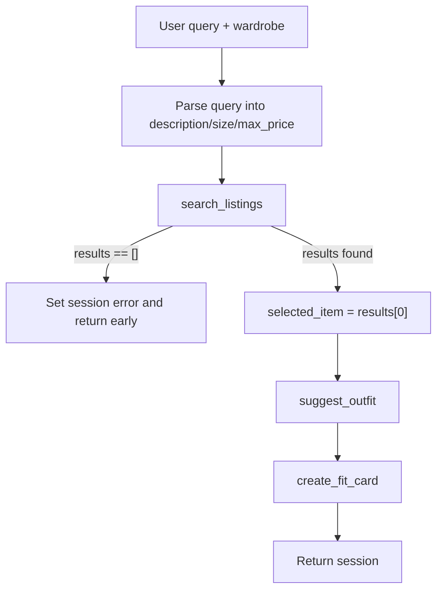

# FitFindr

FitFindr is a multi-tool AI agent that helps users find secondhand clothing and figure out how to wear it. A natural-language query flows through a planning loop that searches mock listings, suggests an outfit against the user's wardrobe, and writes a shareable fit card, with a different path when search returns nothing.

```bash
python app.py          # Gradio UI
python agent.py        # CLI happy path + no-results test
pytest tests/          # tool tests (LLM tests skip without GROQ_API_KEY)
```

## Setup

```bash
python -m venv .venv
source .venv/bin/activate          # Mac/Linux
pip install -r requirements.txt
```

Create a `.env` file in the repo root (gitignored; never commit it):

```
GROQ_API_KEY=your_key_here
```

Get a free key at [console.groq.com](https://console.groq.com). Sanity-check the data layer:

```bash
python utils/data_loader.py
```

## Data

`data/listings.json` holds 40 mock secondhand listings. Each listing dict has: `id`, `title`, `description`, `category`, `style_tags`, `size`, `condition`, `price`, `colors`, `brand`, and `platform`.

```python
from utils.data_loader import load_listings, get_example_wardrobe, get_empty_wardrobe
```

`get_example_wardrobe()` returns a closet with 10 items for testing. `get_empty_wardrobe()` is the new-user path for the empty-wardrobe branch.

---

## Tool Inventory

All three tools live in `tools.py`. Signatures match the implementation exactly.

### `search_listings(description, size, max_price)`

| | |
|---|---|
| **Inputs** | `description` (`str`): keywords for what the user wants (e.g. `"vintage graphic tee"`). `size` (`str` \| `None`): size filter; matched loosely (case-insensitive substring, so `"M"` hits `"S/M"`). `None` skips the filter. `max_price` (`float` \| `None`): inclusive price ceiling. `None` skips the filter. |
| **Returns** | `list[dict]`: full listing dicts sorted by keyword relevance (highest first). Score = count of description keywords found in title + description + `style_tags`. Listings that pass filters but score 0 are dropped. Returns `[]` on no match; never raises. |
| **Purpose** | Pure-Python search over `load_listings()`; no LLM. |

Test in isolation:

```bash
python -c "from tools import search_listings; print(search_listings('vintage graphic tee', size=None, max_price=50))"
```

### `suggest_outfit(new_item, wardrobe)`

| | |
|---|---|
| **Inputs** | `new_item` (`dict`): a listing dict, usually `search_results[0]`. `wardrobe` (`dict`): shaped `{"items": [...]}`; each item has `name`, `category`, `colors`, `style_tags`, and optional `notes`. |
| **Returns** | `str`: non-empty outfit suggestion naming specific wardrobe pieces, or general styling advice when `wardrobe["items"]` is empty. LLM errors return a plain fallback string; never `""`, never raises. |
| **Purpose** | Calls Groq `llama-3.3-70b-versatile` to style the thrifted find against what the user already owns. |

Test in isolation:

```bash
python -c "
from tools import search_listings, suggest_outfit
from utils.data_loader import get_empty_wardrobe
r = search_listings('vintage graphic tee', size=None, max_price=50)
print(suggest_outfit(r[0], get_empty_wardrobe()))
"
```

### `create_fit_card(outfit, new_item)`

| | |
|---|---|
| **Inputs** | `outfit` (`str`): the suggestion string from `suggest_outfit`. `new_item` (`dict`): the listing dict (item name, price, platform). |
| **Returns** | `str`: 2-4 sentence casual caption for an OOTD post. Empty/whitespace `outfit` returns a descriptive error string (no exception). Uses temperature 1.0 so output varies across inputs. |
| **Purpose** | Calls Groq `llama-3.3-70b-versatile` to turn the outfit into something shareable. |

Test in isolation:

```bash
python -c "from tools import create_fit_card; print(create_fit_card('', {'title': 'Faded Band Tee', 'price': 22, 'platform': 'Depop'}))"
```

---

## Planning Loop

`run_agent()` in `agent.py` walks a fixed tool order but **branches on results**; it does not call all three tools unconditionally.



**Step-by-step conditional logic:**

1. **Parse:** `_parse_query()` uses regex to pull `max_price` (`under $30`, `below 40`, bare `$25`) and `size` (`size M`, standalone `XXS`/`XS`/`XL`/`XXL`). Leftover text becomes `description`. Stored in `session["parsed"]`.
2. **Search:** `search_listings(**parsed)` → `session["search_results"]`.
3. **Branch (the decision that matters):**
   - **If** `search_results` is empty → build a criteria-specific `session["error"]` (names description, price, and size when present) and **return early**. `selected_item`, `outfit_suggestion`, and `fit_card` stay `None`. `suggest_outfit` is **not** called.
   - **Else** → `session["selected_item"] = search_results[0]`.
4. **Suggest:** `suggest_outfit(selected_item, wardrobe)` → `session["outfit_suggestion"]`.
5. **Fit card:** `create_fit_card(outfit_suggestion, selected_item)` → `session["fit_card"]`.
6. **Return** the session.

The loop is done when it either hits the early return (error) or fills `fit_card`.

---

## State Management

Everything for one interaction lives in a single `session` dict from `_new_session()`. Each tool writes its output into the session; the next tool reads from it, so the user never re-enters data between steps.

| Key | When set | Used by |
|-----|----------|---------|
| `query` | Session start | Reference only |
| `parsed` | After `_parse_query()` | Arguments to `search_listings` |
| `search_results` | After search | Branch check; source for `selected_item` |
| `selected_item` | Top result on happy path | `suggest_outfit`, `create_fit_card` |
| `wardrobe` | Session start | `suggest_outfit` |
| `outfit_suggestion` | After suggest | `create_fit_card` |
| `fit_card` | After fit card | UI panel 3 |
| `error` | No-results early return | UI panel 1 only |

**State passing example:** `search_results[0]` is stored as `selected_item` and passed unchanged into both `suggest_outfit` and `create_fit_card`. `outfit_suggestion` flows directly into `create_fit_card` without the user typing it again.

`handle_query()` in `app.py` calls `run_agent()`, then maps the session to three Gradio panels: listing details, outfit idea, fit card. On error, only the first panel shows the message.

---

## Error Handling

Every tool handles its own failure mode with a specific, actionable response: no silent failures, no crashes.

### `search_listings`: no results

Returns `[]` (no exception). The planning loop sets `session["error"]` and stops before styling tools run. `fit_card` stays `None`.

```bash
python -c "from tools import search_listings; print(search_listings('designer ballgown', size='XXS', max_price=5))"
# → []
```

Through the agent (`python agent.py` or the Gradio UI with the same query):

> No listings matched 'designer ballgown' under $5 in size XXS. Try raising your price, or dropping the size filter, or using different keywords.

### `suggest_outfit`: empty wardrobe

Detects empty `wardrobe["items"]` and returns general styling advice for the item instead of crashing. The happy path continues to `create_fit_card`.

```bash
python -c "
from tools import search_listings, suggest_outfit
from utils.data_loader import get_empty_wardrobe
r = search_listings('vintage graphic tee', size=None, max_price=50)
print(suggest_outfit(r[0], get_empty_wardrobe()))
"
```

Returns a useful string (e.g. what vibe the piece suits and what kinds of pieces pair well), not `""`, and no exception.

**LLM/API errors:** `try/except` catches Groq failures and returns a plain fallback string naming the item so the loop keeps going.

### `create_fit_card`: missing outfit

Guards empty or whitespace-only `outfit` and returns an error string; no exception, no blank card.

```bash
python -c "from tools import create_fit_card; print(create_fit_card('', {'title': 'Faded Band Tee', 'price': 22, 'platform': 'Depop'}))"
```

> Can't write a fit card without an outfit yet. Run suggest_outfit first so there's a look to caption.

**LLM/API errors:** `try/except` returns a plain fallback caption naming the item, price, and platform.

---

## Spec Reflection

**How the spec helped:** Writing tool inputs, return types, and the empty-results branch in `planning.md` before coding made each tool testable in isolation. The explicit rule "if `search_results` is empty, return early and do not call `suggest_outfit`" prevented the most common agent bug: running styling tools on empty search input. The architecture diagram gave a concrete checklist when reviewing generated loop code: branch on results, write every intermediate value to `session`, leave `fit_card` as `None` on the error path.

**One divergence:** Query parsing uses regex (`_parse_query`) instead of asking the LLM to extract size and price. I chose regex because it is deterministic, free, and easy to test in `agent.py` without an API key. The tradeoff is that unusual phrasing may not parse perfectly, but `search_listings` still does forgiving keyword scoring with stopword filtering on whatever text remains as `description`.

---

## AI Usage

### Instance 1: `search_listings`

- **Input given:** Tool 1 block from `planning.md` (inputs, return type, scoring rule, empty-list failure mode), plus instruction to use `load_listings()` from the data loader.
- **AI produced:** A filter-and-score implementation over the listings dataset with price ceiling, loose size substring match, keyword overlap scoring, and empty-list return.
- **Reviewed / overridden:** Added `_STOPWORDS` in `_keywords()` so filler words like "looking", "under", and "size" do not inflate relevance scores. Verified with pytest: happy-path results, `[]` for impossible queries, and `price <= max_price` on filtered results.

### Instance 2: `run_agent` planning loop

- **Input given:** Architecture diagram plus Planning Loop and State Management sections from `planning.md`.
- **AI produced:** Seven-step `run_agent()` that parses the query, searches, branches on empty results, selects the top item, calls `suggest_outfit` and `create_fit_card`, and returns the session.
- **Reviewed / overridden:** Confirmed the no-results path sets `session["error"]` and returns before `suggest_outfit` (not all three tools unconditionally). Tightened the error string to name the exact criteria searched and specific fixes (raise price / drop size filter / different keywords), built from whichever parsed fields were actually present.

### Instance 3: `suggest_outfit` and `create_fit_card`

- **Input given:** Tool 2 and Tool 3 blocks from `planning.md`, including empty-wardrobe handling, empty-outfit guard, and higher temperature for fit-card variation.
- **AI produced:** Two-branch LLM prompts (named wardrobe pieces vs. general advice), empty-outfit guard returning a string, and Groq calls with `temperature=1.0` on `create_fit_card`.
- **Reviewed / overridden:** Wrapped both LLM tools in `try/except` returning fallback strings so a network or API error never breaks the loop. Added pytest tests for empty wardrobe, empty outfit, and whitespace-only outfit.

---

## Running the App

```bash
python app.py
```

Open the URL shown in your terminal (often `http://localhost:7860`; the port may differ).

**Happy-path query:** `vintage graphic tee under $30` with "Example wardrobe". All three panels populate (listing, outfit idea, fit card).

**Failure query:** `designer ballgown size XXS under $5`, pre-loaded in the example queries. Only the first panel shows the actionable error; outfit and fit card stay empty.

**Demo video:** Record a 3-5 minute walkthrough (happy path with narration of each tool, state passing between steps, and at least one triggered failure) and submit via the Course Portal.
